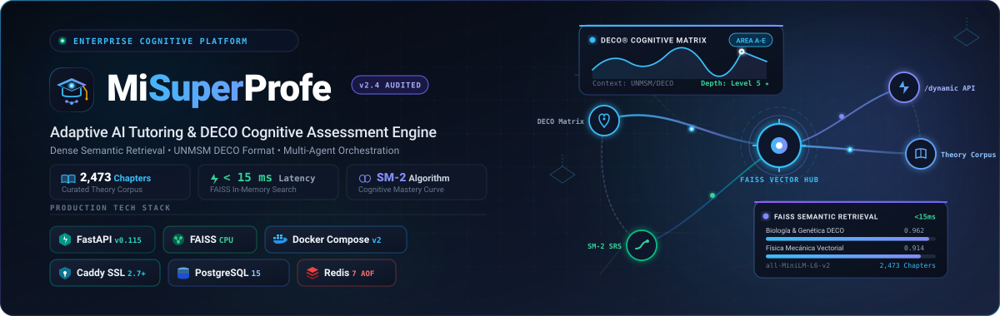
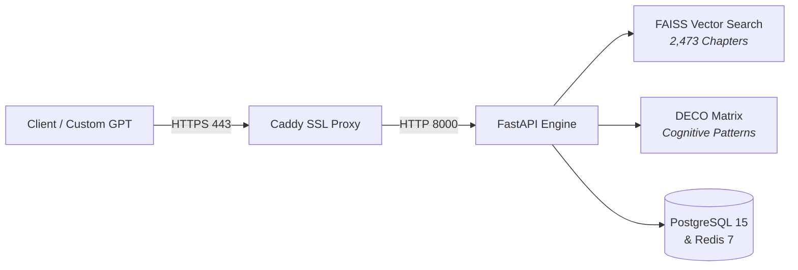

<p align="center">
  
</p>

# 🎓 MiSuperProfe

<div align="center">

### Adaptive AI Tutoring & DECO Cognitive Assessment Engine

[](https://www.python.org/)
[](https://fastapi.tiangolo.com)
[](https://github.com/facebookresearch/faiss)
[](https://docs.docker.com/compose/)
[](https://caddyserver.com/)
[](LICENSE)

**An adaptive AI backend engineered for high-stakes university entrance exams (UNMSM DECO format), combining local vector theory retrieval with situation-based problem generation.**

[Quickstart](#-quickstart) • [Architecture](#-architecture) • [Features](#-key-features) • [Branch Guide](#-repository-branches) • [License](#-license)

</div>

---

## ⚡ Overview

**MiSuperProfe** transforms rote exam preparation into contextual cognitive evaluation. Instead of simple memorization flashcards, it dynamically constructs problems rooted in authentic scenarios (clinical cases, engineering challenges, ethical dilemmas) using a local knowledge corpus of **2,473 curated textbook chapters** across 10 disciplines.

---

## 🏛️ Architecture



---

## 🚀 Key Features

* 🧠 **DECO Cognitive Engine:** Generates contextual questions tailored to specific academic streams (Health Sciences, Engineering, Humanities) across multiple cognitive difficulty levels.
* 🔍 **Local Semantic Search:** Embedded FAISS retrieval with sub-15ms latency over 2,473 chapters, eliminating external vector database dependencies and latency.
* ⚡ **Polymorphic `/dynamic` API:** A single resilient gateway endpoint handling practice sessions, curriculum discovery, and SuperMemo SM-2 spaced repetition (SRS).
* 🐳 **Production Docker Stack:** Zero-configuration SSL via Caddy, healthy database orchestration, automated backups, and container restart policies.

---

## 🛠️ Quickstart

Run the full stack locally with Docker Compose in 3 commands:

```bash
# 1. Clone the repository
git clone https://github.com/armando-token/misuperprofe.git
cd misuperprofe

# 2. Setup environment configuration
cp .env.example .env

# 3. Launch container stack
docker compose up -d
```

Verify service availability:
```bash
curl -s http://localhost:8000/api/v1/agent/health
# {"status":"ok","service":"Agent Service"}
```

API documentation is immediately available at `http://localhost:8000/docs`.

---

## 📡 API Example (`/dynamic`)

Practice session request using the centralized dynamic gateway:

```bash
curl -X POST "http://localhost:8000/api/v1/dynamic" \
  -H "Content-Type: application/json" \
  -H "Authorization: Bearer <API_KEY>" \
  -d '{
    "action": "practice",
    "course": "biologia",
    "user_id": "student_01"
  }'
```

```json
{
  "success": true,
  "data": {
    "question": "En un paciente con acidosis metabólica compensada...",
    "options": ["A) ...", "B) ...", "C) ...", "D) ..."],
    "cognitive_skill": "análisis",
    "topic": "Fisiología Renal"
  }
}
```

---

## 🌿 Repository Branches

This repository maintains the complete historical evolution of the platform:

| Branch / Tag | Description | Era |
| :--- | :--- | :--- |
| **`main`** | **Production Release (v13.0):** Final modular architecture with FAISS, DECO engine, Docker, and Caddy. | August 2025 |
| **`v14`** | **Milestone Snapshot:** Clean code audit, dynamic configuration, and UX enhancer subsystem. | July 2025 |
| **`v12`** | **Legacy Prototype:** Initial monolithic FastAPI backend with ChatGPT Team OAuth and basic SRS. | July 2025 |

---

## 📄 License & Contributing

* **Contributing:** Please see [CONTRIBUTING.md](CONTRIBUTING.md) for branch workflows and code style guidelines.
* **Security:** Review [SECURITY.md](SECURITY.md) for vulnerability disclosure protocols.
* **License:** Released under the [MIT License](LICENSE). Copyright (c) 2024–2026 Armando Silva.
